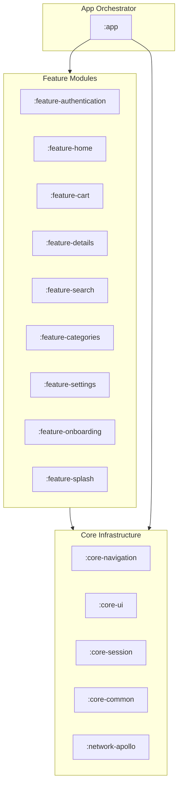
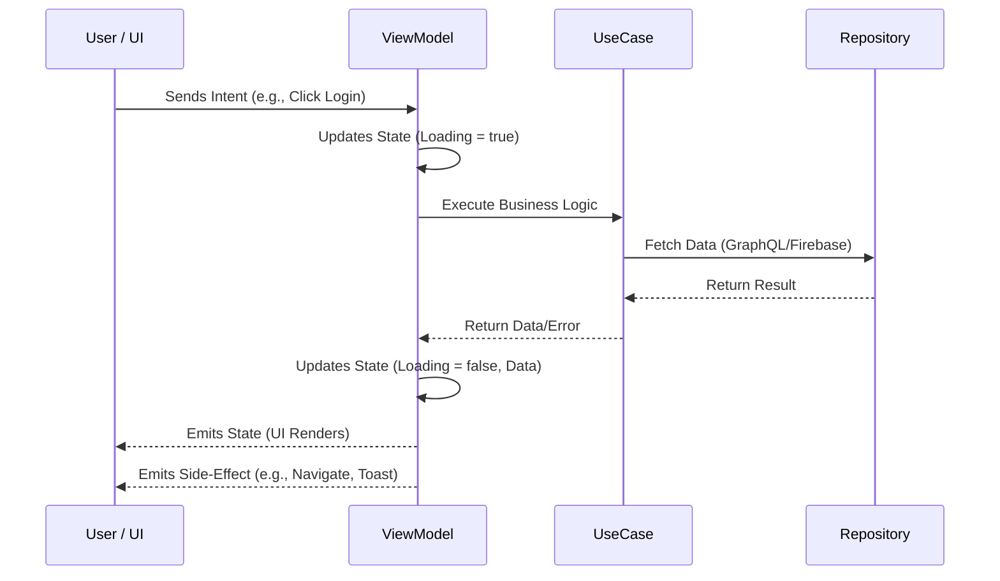

# 🛒 BuyZone - Premier E-Commerce Android Suite

[](https://kotlinlang.org)
[](https://developer.android.com/jetpack/compose)
[](https://insert-koin.io/)
[](https://www.apollographql.com/docs/kotlin/)

**BuyZone** is a production-grade, multi-module Android application engineered with modern architectural patterns. It serves as a comprehensive demonstration of high-performance E-Commerce functionality, utilizing a robust tech stack including Jetpack Compose, Apollo GraphQL, and Firebase.

---

## 🏗 High-Level Architecture

BuyZone follows a **Modular Clean Architecture** approach, ensuring high decoupling and scalability. The project is divided into layers: **Core Infrastructure**, **Feature Modules**, and the **App Orchestrator**.

### Module Dependency Graph



---

## 🚦 Design Pattern: MVI (Model-View-Intent)

The presentation layer utilizes the **MVI pattern** to ensure a predictable state and unidirectional data flow (UDF).

### MVI Workflow



---

## 🛠 Tech Stack Details

### Core Technologies
- **Jetpack Compose**: 100% declarative UI with Material 3.
- **Koin**: Dependency injection throughout all modules for efficient lifecycle management.
- **Coroutines & Flow**: Handling asynchronous data streams and reactive state updates.

### Data Layer
- **Apollo GraphQL**: Integration with Shopify/custom GraphQL backends, providing type-safe query generation and optimized networking.
- **Firebase Suite**: 
    - **Authentication**: Social login (Google, Facebook) and traditional email/password.
    - **Firestore**: NoSQL real-time database for user profiles and session data.
- **Coil**: Advanced image loading with custom shimmer placeholders.

### Navigation
- **Navigation Compose**: Type-safe navigation routes across modules, managed centrally in `:core-navigation`.

---

## 📂 Deep Dive: Module Responsibilities

| Module | Purpose | Key Components |
| :--- | :--- | :--- |
| **`:app`** | Orchestrator | Dependency wiring, Main Activity, App-wide navigation host. |
| **`:core-ui`** | Design System | Theme (Typography, Colors), Custom Modifiers (Shimmer), Base Components. |
| **`:core-common`** | Shared Business | Reusable UI (Product Cards, Section Headers), Domain Error handling. |
| **`:network-apollo`**| Data Access | GraphQL schema definitions, Apollo Client setup, Generated data models. |
| **`:feature-home`** | Discovery | Multi-section dashboard (Promos, Trending, Brands). |
| **`:feature-auth`** | Identity | Login/Signup flows, Validation chains, Social auth handlers. |

---

## 🚀 Key Technical Features

### 🧩 Custom Validation Chains
Implemented a robust validation system for authentication:
- **`ValidationHandler`**: Decouples validation logic from ViewModels.
- **`Email/PasswordValidationChain`**: Fluent API for complex input requirements.

### ✨ Shimmer Loading System
Custom-built shimmer modifiers in `:core-ui` integrated with `:core-common` components, providing a seamless loading experience during GraphQL fetches.

### 🌐 Social Auth Integration
Built-in support for multiple identity providers:
- **Google One Tap API** integration.
- **Facebook SDK** integration.
- **Guest Access** mode for low-friction exploration.

---

## 🛠 Local Setup

1. **Environment**: Ensure you have Android Studio Ladybug+ installed.
2. **Firebase**:
   - Add `google-services.json` to the `app/` directory.
   - Configure SHA-1/SHA-256 for Social Login in Firebase Console.
3. **GraphQL**:
   - The project uses Apollo. Schema is located in `:network-apollo`.
   - Run `./gradlew generateApolloSources` to generate types.
4. **Build**:
   ```bash
   ./gradlew assembleDebug
   ```

---

Developed with a focus on **Clean Code**, **SOLID Principles**, and **Performance**.
